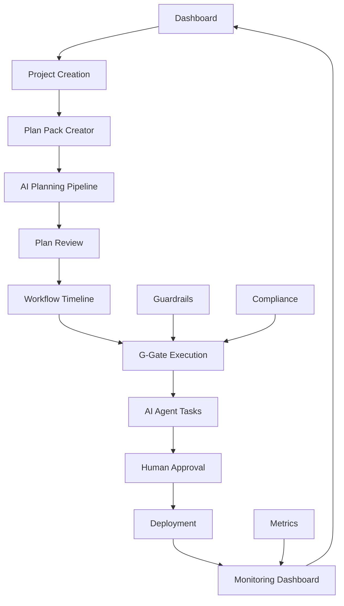

## 1. Product Overview

The AI-First Enterprise Blueprint Platform is a comprehensive web application that transforms the current HTML proof of concept into a fully-featured software platform for managing AI-driven enterprise development workflows. The platform enables non-coding founders to orchestrate AI agent teams through structured development lifecycles, from initial idea conception through production deployment and operations.

The platform solves the problem of complex enterprise software development by providing a guided, AI-first approach with built-in guardrails, compliance tracking, and automated quality gates. Target users include startup founders, product managers, and enterprise teams looking to leverage AI for software development while maintaining enterprise-grade security and compliance standards.

## 2. Core Features

### 2.1 User Roles

| Role | Registration Method | Core Permissions |
|------|---------------------|------------------|
| Founder/Owner | Email registration with organization setup | Full access to all features, approval gates, team management |
| Team Member | Invitation-based registration | Access to assigned projects, view dashboards, contribute to workflows |
| Viewer | Read-only invitation | View project status, dashboards, and documentation |
| AI Agent | System-generated | Automated task execution within defined guardrails |

### 2.2 Feature Module

Our AI-First Blueprint Platform consists of the following main pages:

1. **Dashboard**: Project overview, active workflows, key metrics, and quick actions
2. **Project Management**: Create, configure, and manage AI-first development projects
3. **Plan Pack Creator**: Interactive wizard for generating comprehensive project plans from ideas
4. **Workflow Timeline**: Visual representation and management of G-Gate development lifecycle
5. **AI Agent Management**: Configure, monitor, and control specialized AI agents
6. **Guardrails & Compliance**: Security controls, compliance tracking, and audit trails
7. **Metrics & Analytics**: DORA metrics, FinOps tracking, and performance dashboards
8. **Documentation Hub**: Centralized documentation, templates, and knowledge base
9. **Settings & Administration**: User management, integrations, and system configuration

### 2.3 Page Details

| Page Name | Module Name | Feature description |
|-----------|-------------|---------------------|
| Dashboard | Project Overview | Display active projects, workflow status, key metrics, and recent activities |
| Dashboard | Quick Actions | Provide shortcuts to create new projects, run AI workflows, and access frequently used features |
| Dashboard | Notifications Center | Show alerts, approvals needed, and system notifications |
| Project Management | Project Creation | Create new projects with templates, configure AI agents, and set initial parameters |
| Project Management | Project Configuration | Manage project settings, team assignments, and workflow customization |
| Project Management | Project Archive | View completed projects, export data, and access historical information |
| Plan Pack Creator | Idea Input Wizard | Guided form for capturing project ideas, requirements, and constraints |
| Plan Pack Creator | AI Planning Pipeline | Automated generation of comprehensive project plans through P0-P6 gates |
| Plan Pack Creator | Plan Review & Approval | Human review interface for approving AI-generated plans with scoring and feedback |
| Plan Pack Creator | Plan Export & Download | Generate structured documentation packages and export to various formats |
| Workflow Timeline | G-Gate Visualization | Interactive timeline showing development lifecycle from G0 to G8 |
| Workflow Timeline | Gate Management | Approve/reject gates, view gate details, and track progress |
| Workflow Timeline | Task Assignment | Assign tasks to AI agents or team members with deadlines and dependencies |
| AI Agent Management | Agent Configuration | Set up and configure specialized AI agents (Planner, Security, SRE, etc.) |
| AI Agent Management | Agent Monitoring | Real-time monitoring of AI agent activities, performance, and resource usage |
| AI Agent Management | Agent Governance | Control AI access, audit trails, and compliance with governance policies |
| Guardrails & Compliance | Security Controls | Configure and monitor zero-trust code acceptance, SAST/DAST, and vulnerability management |
| Guardrails & Compliance | Audit Trail | Immutable logging of all AI activities, decisions, and human approvals |
| Guardrails & Compliance | Compliance Dashboard | Track compliance with GDPR, AI Act, NIST AI RMF, and other regulations |
| Metrics & Analytics | DORA Metrics | Track deployment frequency, lead time, change failure rate, and MTTR |
| Metrics & Analytics | FinOps Dashboard | Monitor costs, budget guardrails, and resource optimization |
| Metrics & Analytics | Custom Reports | Generate custom reports and analytics for stakeholders |
| Documentation Hub | Template Library | Access to pre-built templates for various document types and workflows |
| Documentation Hub | Knowledge Base | Searchable repository of best practices, guides, and troubleshooting |
| Documentation Hub | API Documentation | Comprehensive API documentation for integrations and extensions |
| Settings & Administration | User Management | Manage team members, roles, and permissions |
| Settings & Administration | Integration Management | Configure third-party integrations (GitHub, Slack, cloud providers) |
| Settings & Administration | System Configuration | Global settings, security policies, and platform customization |

## 3. Core Process

### Main User Flow

1. **Project Initiation**: User creates a new project and inputs their idea through the Plan Pack Creator wizard
2. **AI Planning**: The system runs the automated planning pipeline (P0-P6) with AI agents generating comprehensive documentation
3. **Plan Approval**: User reviews and approves the generated plan pack with scoring and feedback mechanisms
4. **Development Lifecycle**: Project progresses through G-Gates (G0-G8) with AI agents executing tasks and human approval at key checkpoints
5. **Continuous Monitoring**: Real-time tracking of metrics, compliance, and progress through integrated dashboards
6. **Deployment & Operations**: Automated deployment with progressive delivery and continuous monitoring

### AI Agent Flow

1. **Task Assignment**: AI agents receive tasks based on their specialization and current workload
2. **Execution**: Agents execute tasks within defined guardrails and security constraints
3. **Review & Validation**: Dual-AI review process with security and test agents before human approval
4. **Documentation**: Automatic generation of documentation, audit trails, and provenance records
5. **Feedback Loop**: Continuous learning and improvement based on outcomes and human feedback

## 4. User Interface Design

### 4.1 Design Style

- **Primary Colors**: Blue (#1d4ed8) for primary actions, Purple (#7c3aed) for AI-related features
- **Secondary Colors**: Gray scale (#f8f9fa to #212529) for backgrounds and text
- **Button Style**: Rounded corners (8px), subtle shadows, hover states with color transitions
- **Font**: Inter font family with weights 400, 600, 700, 900 for hierarchy
- **Layout Style**: Card-based design with clean spacing, sticky navigation, responsive grid layouts
- **Icons**: Emoji-based icons for AI agents, modern outline icons for UI elements
- **Animation**: Smooth transitions (0.3s ease), loading spinners, progressive disclosure

### 4.2 Page Design Overview

| Page Name | Module Name | UI Elements |
|-----------|-------------|-------------|
| Dashboard | Project Overview | Grid layout with project cards, status indicators, progress bars, metric widgets |
| Dashboard | Quick Actions | Floating action buttons, modal dialogs, wizard interfaces |
| Plan Pack Creator | AI Pipeline | Step-by-step wizard, progress indicators, real-time log display, approval interfaces |
| Workflow Timeline | G-Gate Timeline | Vertical timeline with expandable sections, status badges, interactive elements |
| AI Agent Management | Agent Cards | Grid of agent cards with status lights, performance metrics, configuration panels |
| Metrics & Analytics | Charts & Graphs | Radar charts for DORA metrics, donut charts for resource allocation, line charts for trends |
| Guardrails & Compliance | Control Panels | Toggle switches, status indicators, audit log tables, compliance checklists |

### 4.3 Responsiveness

The platform is designed mobile-first with responsive breakpoints at 768px (tablet) and 1024px (desktop). Touch-optimized interactions for mobile devices with appropriate button sizes and gesture support. Progressive enhancement ensures core functionality works across all device types.

## 5. Technical Architecture Requirements

### 5.1 Frontend Requirements
- React-based single-page application with TypeScript
- State management with Redux Toolkit or Zustand
- Real-time updates using WebSocket connections
- Chart.js for data visualizations
- Tailwind CSS for styling with custom design system
- Progressive Web App (PWA) capabilities

### 5.2 Backend Requirements
- Node.js/Express API server or Python/FastAPI
- Real-time capabilities with Socket.io or WebSocket
- Background job processing for AI workflows
- File upload and processing for documents
- Integration APIs for third-party services

### 5.3 Database Requirements
- PostgreSQL for relational data (users, projects, workflows)
- Redis for caching and session management
- Document storage for generated plans and documentation
- Audit logging with immutable records

### 5.4 AI Integration Requirements
- Integration with multiple LLM providers (OpenAI, Anthropic, Google)
- Prompt management and versioning system
- AI agent orchestration and workflow management
- Token usage tracking and cost optimization

### 5.5 Security & Compliance Requirements
- OAuth 2.0 authentication with RBAC
- End-to-end encryption for sensitive data
- Audit logging and compliance reporting
- GDPR and AI Act compliance features
- Zero-trust security model implementation

## 6. Integration Requirements

### 6.1 Development Tools
- GitHub/GitLab integration for code repositories
- CI/CD pipeline integration (GitHub Actions, Jenkins)
- Docker and Kubernetes for containerization
- Monitoring tools (Prometheus, Grafana)

### 6.2 Communication Tools
- Slack/Microsoft Teams notifications
- Email integration for alerts and reports
- Calendar integration for scheduling

### 6.3 Cloud Providers
- AWS/Azure/GCP integration for infrastructure
- Cloud cost management APIs
- Serverless function deployment

## 7. Data Model Requirements

### 7.1 Core Entities
- **Users**: Authentication, roles, preferences
- **Organizations**: Multi-tenant support, billing
- **Projects**: Project metadata, configuration, status
- **Workflows**: G-Gate definitions, progress tracking
- **AI Agents**: Configuration, performance metrics
- **Documents**: Generated plans, templates, exports
- **Audit Logs**: Immutable activity records
- **Metrics**: DORA metrics, FinOps data, custom KPIs

### 7.2 Relationships
- Users belong to Organizations
- Projects belong to Organizations and have assigned Users
- Workflows belong to Projects and track Gates
- AI Agents are assigned to Projects and execute Tasks
- Documents are generated by Workflows and stored with versioning
- Audit Logs track all system activities with full traceability

## 8. Performance Requirements

### 8.1 Response Times
- Page load times under 2 seconds
- API response times under 500ms for standard operations
- Real-time updates with sub-second latency
- AI workflow completion within defined SLAs

### 8.2 Scalability
- Support for 1000+ concurrent users
- Horizontal scaling for AI agent workloads
- Database optimization for large datasets
- CDN integration for global performance

### 8.3 Availability
- 99.9% uptime SLA
- Automated failover and recovery
- Regular backup and disaster recovery
- Health monitoring and alerting

## 9. Migration Strategy

### 9.1 Phase 1: Core Platform
- Convert HTML proof of concept to React application
- Implement user authentication and basic project management
- Create Plan Pack Creator with AI integration
- Basic dashboard and navigation

### 9.2 Phase 2: AI Workflows
- Implement G-Gate workflow engine
- AI agent management and orchestration
- Real-time monitoring and notifications
- Basic metrics and reporting

### 9.3 Phase 3: Advanced Features
- Advanced analytics and custom reports
- Third-party integrations
- Compliance and audit features
- Mobile optimization and PWA

### 9.4 Phase 4: Enterprise Features
- Multi-tenant architecture
- Advanced security features
- Custom AI model integration
- Enterprise support and SLAs