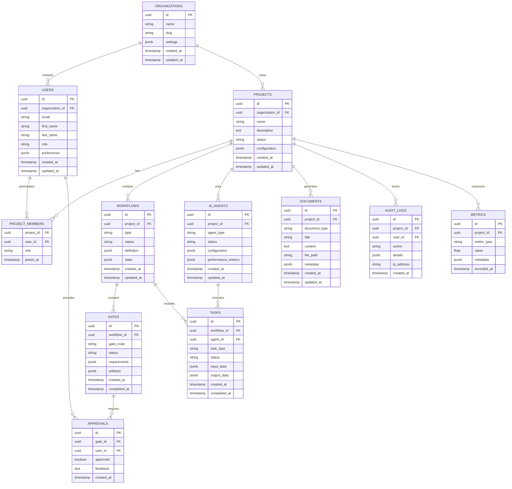

## 1. Architecture Design


## 2. Technology Description

- **Frontend**: React@18 + TypeScript + Tailwind CSS + Vite + Chart.js + Socket.io-client
- **Backend**: Node.js@20 + Express@4 + TypeScript + Socket.io + Bull Queue
- **Database**: PostgreSQL@15 + Redis@7 + InfluxDB (time series)
- **Authentication**: Supabase Auth + JWT
- **File Storage**: Supabase Storage
- **AI Integration**: OpenAI API + Anthropic API + Google Gemini API
- **Deployment**: Docker + Docker Compose + Nginx
- **Monitoring**: Prometheus + Grafana + Winston logging

## 3. Route Definitions

| Route | Purpose |
|-------|----------|
| / | Landing page and authentication |
| /dashboard | Main dashboard with project overview and metrics |
| /projects | Project management and listing |
| /projects/:id | Individual project details and configuration |
| /projects/:id/plan-pack | Plan Pack Creator wizard |
| /projects/:id/workflow | G-Gate workflow timeline and management |
| /projects/:id/agents | AI agent management and monitoring |
| /projects/:id/metrics | Project-specific metrics and analytics |
| /guardrails | Global guardrails and compliance dashboard |
| /documentation | Documentation hub and knowledge base |
| /settings | User and organization settings |
| /admin | Administrative functions (admin users only) |

## 4. API Definitions

### 4.1 Authentication APIs

**User Registration**
```
POST /api/auth/register
```

Request:
| Param Name | Param Type | isRequired | Description |
|------------|------------|------------|-------------|
| email | string | true | User email address |
| password | string | true | User password (min 8 chars) |
| firstName | string | true | User first name |
| lastName | string | true | User last name |
| organizationName | string | false | Organization name for new orgs |

Response:
| Param Name | Param Type | Description |
|------------|------------|-------------|
| user | object | User profile information |
| token | string | JWT authentication token |
| organization | object | Organization details |

**User Login**
```
POST /api/auth/login
```

Request:
| Param Name | Param Type | isRequired | Description |
|------------|------------|------------|-------------|
| email | string | true | User email address |
| password | string | true | User password |

Response:
| Param Name | Param Type | Description |
|------------|------------|-------------|
| user | object | User profile information |
| token | string | JWT authentication token |
| organization | object | Organization details |

### 4.2 Project Management APIs

**Create Project**
```
POST /api/projects
```

Request:
| Param Name | Param Type | isRequired | Description |
|------------|------------|------------|-------------|
| name | string | true | Project name |
| description | string | true | Project description |
| template | string | false | Project template ID |
| aiAgents | array | false | List of AI agents to enable |

Response:
| Param Name | Param Type | Description |
|------------|------------|-------------|
| id | string | Project unique identifier |
| name | string | Project name |
| status | string | Project status |
| createdAt | string | Creation timestamp |

**Get Project Details**
```
GET /api/projects/:id
```

Response:
| Param Name | Param Type | Description |
|------------|------------|-------------|
| id | string | Project unique identifier |
| name | string | Project name |
| description | string | Project description |
| status | string | Current project status |
| workflow | object | Current workflow state |
| metrics | object | Project metrics summary |
| team | array | Project team members |

### 4.3 AI Workflow APIs

**Create Plan Pack**
```
POST /api/projects/:id/plan-pack
```

Request:
| Param Name | Param Type | isRequired | Description |
|------------|------------|------------|-------------|
| idea | string | true | Project idea description |
| constraints | array | false | Project constraints |
| targetUsers | string | false | Target user description |
| budget | number | false | Budget constraints |

Response:
| Param Name | Param Type | Description |
|------------|------------|-------------|
| jobId | string | Background job identifier |
| status | string | Job status |
| estimatedDuration | number | Estimated completion time |

**Get Plan Pack Status**
```
GET /api/projects/:id/plan-pack/:jobId
```

Response:
| Param Name | Param Type | Description |
|------------|------------|-------------|
| status | string | Job status (pending/running/completed/failed) |
| progress | number | Completion percentage |
| currentGate | string | Current processing gate |
| artifacts | object | Generated artifacts |
| logs | array | Processing logs |

**Approve Gate**
```
POST /api/projects/:id/workflow/gates/:gate/approve
```

Request:
| Param Name | Param Type | isRequired | Description |
|------------|------------|------------|-------------|
| approved | boolean | true | Approval decision |
| feedback | string | false | Approval feedback |
| conditions | array | false | Conditional approvals |

Response:
| Param Name | Param Type | Description |
|------------|------------|-------------|
| status | string | Gate status after approval |
| nextGate | string | Next gate in workflow |
| actions | array | Required actions |

### 4.4 AI Agent APIs

**Get Agent Status**
```
GET /api/projects/:id/agents
```

Response:
| Param Name | Param Type | Description |
|------------|------------|-------------|
| agents | array | List of project AI agents |
| status | string | Overall agent health |
| activeJobs | number | Number of active jobs |
| performance | object | Performance metrics |

**Configure Agent**
```
PUT /api/projects/:id/agents/:agentType
```

Request:
| Param Name | Param Type | isRequired | Description |
|------------|------------|------------|-------------|
| enabled | boolean | true | Enable/disable agent |
| configuration | object | false | Agent-specific configuration |
| permissions | array | false | Agent permissions |

Response:
| Param Name | Param Type | Description |
|------------|------------|-------------|
| agentType | string | Agent type identifier |
| status | string | Agent status |
| configuration | object | Current configuration |

### 4.5 Metrics APIs

**Get DORA Metrics**
```
GET /api/projects/:id/metrics/dora
```

Query Parameters:
| Param Name | Param Type | isRequired | Description |
|------------|------------|------------|-------------|
| timeRange | string | false | Time range (7d, 30d, 90d) |
| granularity | string | false | Data granularity (daily, weekly) |

Response:
| Param Name | Param Type | Description |
|------------|------------|-------------|
| deploymentFrequency | number | Deployments per day |
| leadTime | number | Lead time in hours |
| changeFailureRate | number | Failure rate percentage |
| mttr | number | Mean time to recovery in hours |
| trend | object | Trend data over time |

**Get FinOps Metrics**
```
GET /api/projects/:id/metrics/finops
```

Response:
| Param Name | Param Type | Description |
|------------|------------|-------------|
| totalCost | number | Total project cost |
| costByService | object | Cost breakdown by service |
| budgetUtilization | number | Budget utilization percentage |
| forecast | object | Cost forecast |
| alerts | array | Cost alerts and warnings |

## 5. Server Architecture Diagram


## 6. Data Model

### 6.1 Data Model Definition



### 6.2 Data Definition Language

**Organizations Table**
```sql
-- Create organizations table
CREATE TABLE organizations (
    id UUID PRIMARY KEY DEFAULT gen_random_uuid(),
    name VARCHAR(255) NOT NULL,
    slug VARCHAR(100) UNIQUE NOT NULL,
    settings JSONB DEFAULT '{}',
    created_at TIMESTAMP WITH TIME ZONE DEFAULT NOW(),
    updated_at TIMESTAMP WITH TIME ZONE DEFAULT NOW()
);

-- Create index
CREATE INDEX idx_organizations_slug ON organizations(slug);
```

**Users Table**
```sql
-- Create users table
CREATE TABLE users (
    id UUID PRIMARY KEY DEFAULT gen_random_uuid(),
    organization_id UUID NOT NULL REFERENCES organizations(id) ON DELETE CASCADE,
    email VARCHAR(255) UNIQUE NOT NULL,
    first_name VARCHAR(100) NOT NULL,
    last_name VARCHAR(100) NOT NULL,
    role VARCHAR(50) DEFAULT 'member' CHECK (role IN ('owner', 'admin', 'member', 'viewer')),
    preferences JSONB DEFAULT '{}',
    created_at TIMESTAMP WITH TIME ZONE DEFAULT NOW(),
    updated_at TIMESTAMP WITH TIME ZONE DEFAULT NOW()
);

-- Create indexes
CREATE INDEX idx_users_organization_id ON users(organization_id);
CREATE INDEX idx_users_email ON users(email);
```

**Projects Table**
```sql
-- Create projects table
CREATE TABLE projects (
    id UUID PRIMARY KEY DEFAULT gen_random_uuid(),
    organization_id UUID NOT NULL REFERENCES organizations(id) ON DELETE CASCADE,
    name VARCHAR(255) NOT NULL,
    description TEXT,
    status VARCHAR(50) DEFAULT 'planning' CHECK (status IN ('planning', 'active', 'paused', 'completed', 'archived')),
    configuration JSONB DEFAULT '{}',
    created_at TIMESTAMP WITH TIME ZONE DEFAULT NOW(),
    updated_at TIMESTAMP WITH TIME ZONE DEFAULT NOW()
);

-- Create indexes
CREATE INDEX idx_projects_organization_id ON projects(organization_id);
CREATE INDEX idx_projects_status ON projects(status);
```

**Workflows Table**
```sql
-- Create workflows table
CREATE TABLE workflows (
    id UUID PRIMARY KEY DEFAULT gen_random_uuid(),
    project_id UUID NOT NULL REFERENCES projects(id) ON DELETE CASCADE,
    type VARCHAR(50) NOT NULL CHECK (type IN ('plan_pack', 'g_gate', 'custom')),
    status VARCHAR(50) DEFAULT 'pending' CHECK (status IN ('pending', 'running', 'completed', 'failed', 'cancelled')),
    definition JSONB NOT NULL,
    state JSONB DEFAULT '{}',
    created_at TIMESTAMP WITH TIME ZONE DEFAULT NOW(),
    updated_at TIMESTAMP WITH TIME ZONE DEFAULT NOW()
);

-- Create indexes
CREATE INDEX idx_workflows_project_id ON workflows(project_id);
CREATE INDEX idx_workflows_status ON workflows(status);
CREATE INDEX idx_workflows_type ON workflows(type);
```

**AI Agents Table**
```sql
-- Create ai_agents table
CREATE TABLE ai_agents (
    id UUID PRIMARY KEY DEFAULT gen_random_uuid(),
    project_id UUID NOT NULL REFERENCES projects(id) ON DELETE CASCADE,
    agent_type VARCHAR(50) NOT NULL CHECK (agent_type IN ('planner', 'implementer', 'security', 'test', 'sre', 'finops', 'governance', 'docs')),
    status VARCHAR(50) DEFAULT 'inactive' CHECK (status IN ('active', 'inactive', 'error', 'maintenance')),
    configuration JSONB DEFAULT '{}',
    performance_metrics JSONB DEFAULT '{}',
    created_at TIMESTAMP WITH TIME ZONE DEFAULT NOW(),
    updated_at TIMESTAMP WITH TIME ZONE DEFAULT NOW()
);

-- Create indexes
CREATE INDEX idx_ai_agents_project_id ON ai_agents(project_id);
CREATE INDEX idx_ai_agents_type ON ai_agents(agent_type);
CREATE INDEX idx_ai_agents_status ON ai_agents(status);
```

**Audit Logs Table**
```sql
-- Create audit_logs table
CREATE TABLE audit_logs (
    id UUID PRIMARY KEY DEFAULT gen_random_uuid(),
    project_id UUID REFERENCES projects(id) ON DELETE CASCADE,
    user_id UUID REFERENCES users(id) ON DELETE SET NULL,
    action VARCHAR(100) NOT NULL,
    details JSONB NOT NULL,
    ip_address INET,
    created_at TIMESTAMP WITH TIME ZONE DEFAULT NOW()
);

-- Create indexes
CREATE INDEX idx_audit_logs_project_id ON audit_logs(project_id);
CREATE INDEX idx_audit_logs_user_id ON audit_logs(user_id);
CREATE INDEX idx_audit_logs_action ON audit_logs(action);
CREATE INDEX idx_audit_logs_created_at ON audit_logs(created_at DESC);
```

**Initial Data**
```sql
-- Insert default organization
INSERT INTO organizations (name, slug, settings) VALUES 
('Demo Organization', 'demo-org', '{"features": ["ai_agents", "workflows", "metrics"]}');

-- Insert default admin user
INSERT INTO users (organization_id, email, first_name, last_name, role) VALUES 
((SELECT id FROM organizations WHERE slug = 'demo-org'), 'admin@demo.com', 'Admin', 'User', 'owner');

-- Insert default project template
INSERT INTO projects (organization_id, name, description, status, configuration) VALUES 
((SELECT id FROM organizations WHERE slug = 'demo-org'), 'Sample Project', 'A sample AI-first project', 'planning', 
 '{"template": "ai_first", "agents": ["planner", "security", "test", "sre"]}');
```

## 7. Security Architecture

### 7.1 Authentication & Authorization
- JWT-based authentication with refresh tokens
- Role-based access control (RBAC) with organization-level permissions
- API key authentication for external integrations
- Multi-factor authentication (MFA) support

### 7.2 Data Protection
- Encryption at rest using AES-256
- Encryption in transit using TLS 1.3
- Sensitive data tokenization
- Regular security audits and penetration testing

### 7.3 AI Security
- Prompt injection protection
- AI model access controls and rate limiting
- Audit logging of all AI interactions
- Data privacy controls for AI processing

## 8. Deployment Architecture

### 8.1 Container Strategy
- Docker containers for all services
- Docker Compose for local development
- Kubernetes for production deployment
- Helm charts for configuration management

### 8.2 Environment Configuration
- Development: Local Docker Compose
- Staging: Kubernetes cluster with reduced resources
- Production: Multi-zone Kubernetes deployment
- Monitoring: Prometheus + Grafana + AlertManager

### 8.3 CI/CD Pipeline
- GitHub Actions for automated testing and deployment
- Automated security scanning and dependency checks
- Blue-green deployment strategy
- Automated rollback capabilities